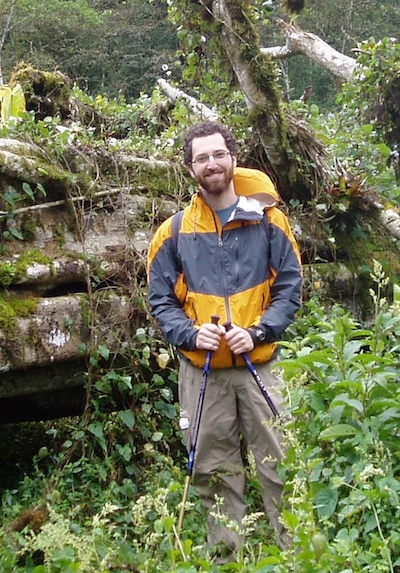






<!-- Make some space -->





I am currently a Turner Postdoctoral Fellow in the Earth and Environmental Sciences Department at the University of Michigan.
My research interests are broad, but focus mainly on understanding the thermodynamics and evolution of the Earth's mantle.
I currently work with Rebecca Lange developing theoretical models for understanding molten silicates.









