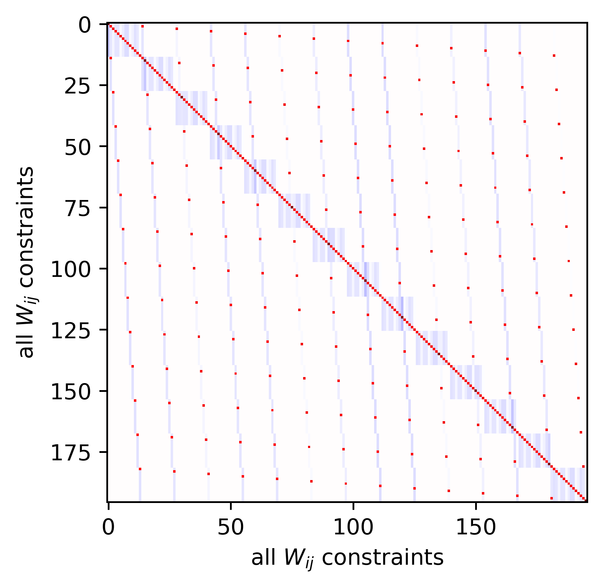

# [[202011300948]] Local regular solution approximation overview
* Local regular solution approximation is derived from calculated chemical potentials and Gibbs curvature at a reference composition; excess mixing parameters are inferred extending accurate extrapolation regime.
- [[202011290649]] Gibbs Curvature for Regular Solution
+ [[202012030549]] Inferring local regular solution params by least-squares
  + [[*TK*]] dependent species transform for complex solution phases
  + [[202011290633]] Regular Solution Model Intro
  + [[202012010818]] Ideal Solution model Intro

While regular solution models [[202011290633]] scan be quite useful, their simplicity limits their applicability to complex ordered phases.
Nevertheless, the ability of the regular solution to capture ideal mixing and roughly represent (in many situations) non-ideal excess interactions makes it attractive for calculations considering local perturbations.
We therefore construct the local regular solution approximation, which relies on evaluating the chemical potentials and Gibbs curvature matrix at a reference state.
Excess solution properties are extracted from this matrix by subtracting off for expected contributions from an ideal solution [[202012010818]].
The chemical potential and Gibbs curvature contributions of the regular solution are fortunately linear in the excess mixing parameters $W_{ij}$, enabling linear least-squares inference of their appropriate values [[*TK*]].
This approach yields a well-behaved perturbation model whose composition-dependence captures the dominant logarithmic and linear terms.
When applied to complex multi-site solution phases, this approximation must be carried out in the augmented dependent-species space (rather than simple independent components) to retain meaningful ideal mixing terms [[*TK*]].

# [[202011290633]] Regular Solution Model Intro
* The regular solution model is the simplest extension of the ideal solution model, accounting for non-negligible mixing energy; its quadratic compositional form leads to linearly-dependent chemical potential terms.
- [[202011290620]] *BASIC THERMODYNAMIC SOLUTION MODELS*
+ [[202011290649]] Gibbs Curvature for Regular Solution
  + [[202011300948]] Local regular solution approximation overview
  + [[202012010818]] Ideal Solution model intro
  + [[*TK*]] Fractional composition-derivative for solution phases

On of the simplest non-ideal solution models is the regular solution, which supplements ideal entropic mixing contributions [[202012010818]] with a non-ideal quadratic excess $\bar{G}^{xs}$:

$$
\bar{G} = \bar{G}^{ideal} + \bar{G}^{xs}\\
\bar{G}^{xs} = \frac12 \sum_i \sum_j W_{ij} X_i X_j
$$

where $W_{ij}$ is the symmetric energy of mixing parameter, and $X_i$ is the fractional composition of the solution.
In some applications, this excess is allowed to vary with temperature and pressure and is thus represented as:

$$
W^G = W^H - W^ST  + W^V P
$$

breaking it down into excess enthalpy ($W^H$), entropy ($W^S$), and volume ($W^V$) contributions.
The chemical potentials for this model are derived from the compositional derivative of the Gibbs energy, yielding:

$$
\mu_k = \mu_k^{ideal} + \mu_k^{xs}\\
\mu_k^{xs} = \sum_i X_i W_{ik} - \frac{1}{2}\sum_i\sum_j W_{ij} X_i X_j = \sum_i X_i W_{ik} - G^{xs}
$$

where the quadratic form of the excess introduces both quadratic and linear composition-dependent terms to the chemical potentials (higher order derivatives are also computationally useful [[202011290649]]).
The retention of the quadratic term during the derivative violates initial intuitions, but it arises straightforwardly from the distinction between absolute molar quantity and mole fractions [[*TK*]].
This symmetric non-ideal model is simple but often quite powerful in describing solution thermodynamics, especially in cases with limited data where even a highly approximate model is useful.
Even in cases where the regular solution is not adequate to accurately represent a phase, it can be adapted for use as a powerful local perturbation model for compositional extrapolation and to speed computations [[202011300948]].

# [[202012010818]] Ideal Solution model intro
* Ideal solution model assumes non-interacting components in the mixture, leading to a weighted average Gibbs energy modified only by the entropy of mixing.
- [[202011290620]] *BASIC THERMODYNAMIC SOLUTION MODELS*
+ [[201804251420]] Ideal Entropy of Mixing
  + [[202011290633]] Regular Solution Model Intro
  + [[202012010810]] Gibbs Curvature for Ideal Solution
  + [[*TK*]] Site multiplicity for solution models

The ideal solution model represents a thermodynamic baseline (or null hypothesis) for mixed phases; though it is rarely used directly, it forms the foundation of nearly all more complicated models.
The fundamental assumption underlying the ideal solution is that the components of the solution behave as energetically independent entities.
The resulting mixture thus has an energy given by the weighted average of the components, modified only by the additional entropy of mixing [[201804251420]], yielding the simple molar Gibbs energy expression:

$$
\bar{G}^{ideal} = \sum_i X_i \mu_i^0 + RTm\sum_i X_i \log X_i
$$

where $\mu_i^0$ are the chemical potentials for each pure endmember component, $X_i$ is the mol-fraction of each component, $RT$ is the thermal energy scale, and $m$ is the site multiplicity [[**TK**]].
The chemical potentials are given by the compositional derivative:

$$
\mu_k = \mu_k^0 + RTm \ln X_k
$$

which emphasizes how the chemical potential of the pure endmember component is only modified by ideal entropy mixing.
A further compositional derivative yields the Gibbs curvature matrix [[202012010810]], useful in many computational applications.
The simplest elaboration on top of the ideal solution is the regular solution [[202011290633]], which incorporates basic interaction energies.

# [[202012010810]] Gibbs Curvature for Ideal Solution
* Gibbs curvature for ideal solutions has large positive composition-dependent values on the diagonal and small fixed negative values off it, reflecting how increasing any component fractionally dilutes all others.
- [[202012010818]] Ideal Solution model intro
- [[202011290649]] Gibbs Curvature for Regular Solution
+ [[*TK*]] Fractional composition-derivative for solution phases
  + [[*TK*]]

The Gibbs curvature matrix for an ideal solution is:

$$
\left(\frac{d \mu_i}{d n_j}\right)^{ideal}  = \frac{RTm} {X_i} (\delta_{ij} - X_i)
$$

where $\delta_{ij}$ is the kronecker delta, reflecting the diagonal stucture of the matrix.
For diagonal elements, the expression simplifies to:

$$
\left(\frac{d \mu_i}{d n_i}\right)^{ideal}  = \frac{RTm} {X_i} (1 - X_i), \;\;\; \textrm{for diagonal elements}
$$

which is generally large and positive, and modified by the reference composition, while off-diagonal elements have the fixed value of:

$$
\left(\frac{d \mu_i}{d n_j}\right)^{ideal}  = -RTm, \;\;\; \textrm{for} \;\;\; i \ne j
$$

which is negative, reflecting the closure condition for normalized fractional compositions (i.e. increasing a single component fractionally dilutes all other components).
This diagonal structure arises directly from the molar derivative of fractional composition ($d X_i/ dn_j$) [[*TK*]].

# [[202011290649]] Gibbs Curvature for Regular Solution
* The regular solution contributes both a constant offset and linear-compositional terms to the Gibbs curvature matrix.
- [[202011290633]] Regular Solution Model Intro
+ [[202011300948]] Local regular solution approximation overview
  + [[202012010810]] Gibbs Curvature for Ideal Solution
  + [[*TK*]] Fractional composition-derivative for solution phases

The Gibbs curvature matrix [[*TK*]] captures the local linear-dependence of the chemical potentials on composition and is highly useful for equilibrium and calibration calculations that require convergence to an optimal solution.
The regular solution, adds three terms to composition-dependence of the chemical potentials:

$$
\frac{d \mu_i}{d n_j} = \left(\frac{d \mu_i}{d n_j}\right)^{ideal} + W_{ij} - \sum_k X_k (W_{ik}+W_{jk})  + G^{xs}
$$

where $n_j$ and $X_i$ are the molar and fractional composition of the solution, and $(d \mu_i/d n_j)^{ideal}$ is the curvature contribution from an ideal solution [[*TK*]].
As for the chemical potentials themselves, this result is somewhat counter-intuitive as the derivative retains quadratic ($G^{xs}$), linear ($X_k W_{ik}$), and constant offset terms ($W_{ij}$), but this arises because the solution depends on (intensive) fractional composition while the Gibbs curvature considers (extensive) molar derivatives.
The derivation for this expression thus follows directly from the molar derivative of fractional composition ($d X_i/ dn_j$), termed Darken's relation *TK*?!? [[*TK*]].
Despite its complex composition-dependence, the linearity of curvature in the mixing parameters ($W_{ij}$) makes it possible to construct a local regular solution approximation for any solution phase [[*TK*]].

# [[202012030549]] Inferring local regular solution params by least-squares
* Local regular solution is determined using least squares by constructing a linear constraint matrix that encodes the linear dependence of excess Gibbs curvature values $(d \mu_i/d n_j)^{xs}$ on the $W_{ij}$ parameters.
- [[202011300948]] Local regular solution approximation overview
+ [[*TK*]]
  + [[202011290649]] Gibbs Curvature for Regular Solution
  + [[202012010810]] Gibbs Curvature for Ideal Solution

A local regular solution [[202011300948]] provides a valuable approximation tool for computational applications.
Training its parameter values is both easy and computationally efficient using standard least-squares inference.
The first step is simply to calculate the excess Gibbs curvature matrix for the reference composition ($X_k$):

$$
\left(\frac{d \mu_i}{d n_j}\right)^{xs} \equiv \frac{d \mu_i}{d n_j} - \left(\frac{d \mu_i}{d n_j}\right)^{ideal}
$$

where $d \mu_i/d n_j$ and $(d \mu_i/d n_j)^{ideal}$ are the local Gibbs curvature and its ideal contribution [[202012010810]].
This curvature excess is linearly related to the unknown regular solution parameters ($W_{ij}$):

$$
\left(\frac{d \mu_i}{d n_j}\right)^{xs} = (W_{ij} + W_{ji})/2 - \sum_k X_k (W_{ik}+W_{ki})/2
$$

where this expression has been modified from its standard form to enforce the required symmetry of the quadratic energy excess properties of the regular solution.

<figure>
  
  <figcaption><b>Fig 1. Constraint matrix for local regular solution parameters $W_{ij}$.</b> Excess energy parameters are determined by least-squares using the constraint (or design) matrix visualized here. Weighting coefficients range from -1 (dark blue) to 0 (white) to +1 (dark red).</figcaption>
</figure>
 

The unknown energy excess parameters can now be determined using least-squares methods by unraveling the constraint and unknown parameter matrices to fit the standard least-squares form ($A x = b$).
The result is a block diagonal constraint (or design) matrix (visualized in the figure) which imposes the direct dependence of each curvature value on its corresponding W parameter (dark red values on main diagonal and in tilted lattice), modified by weighted compositional adjustments (light blue values just off main diagonal and in stripes).
Combining this matrix with the list of excess curvature values determined above, enables direct inference of the unknown parameter values by least squares, which is trivially fast for geological applications and guaranteed to yield a result accurate to within machine precision.
