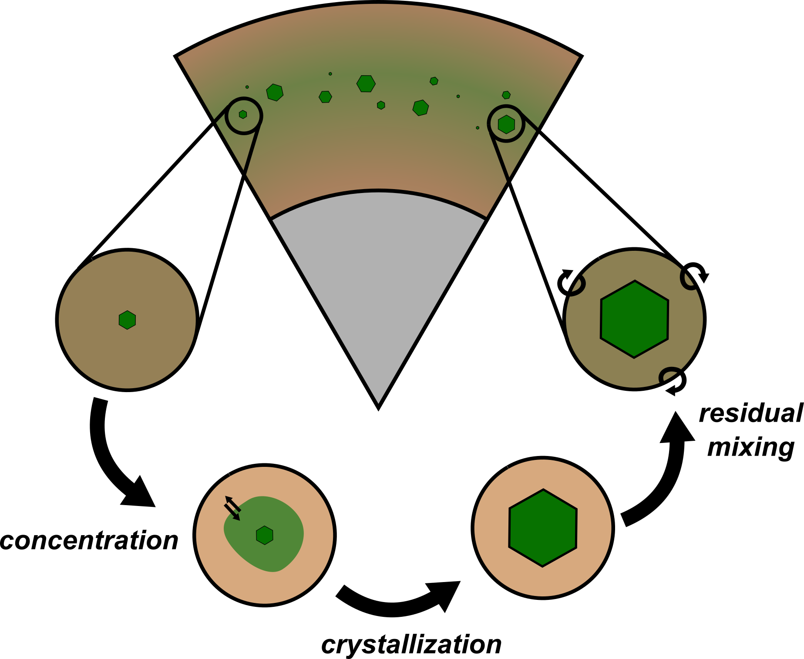
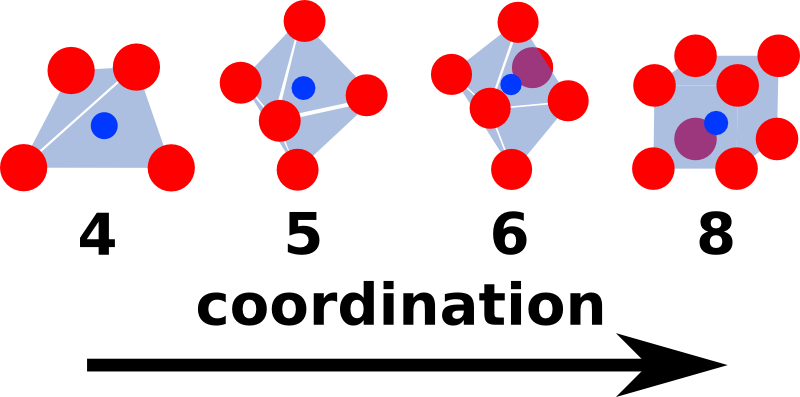
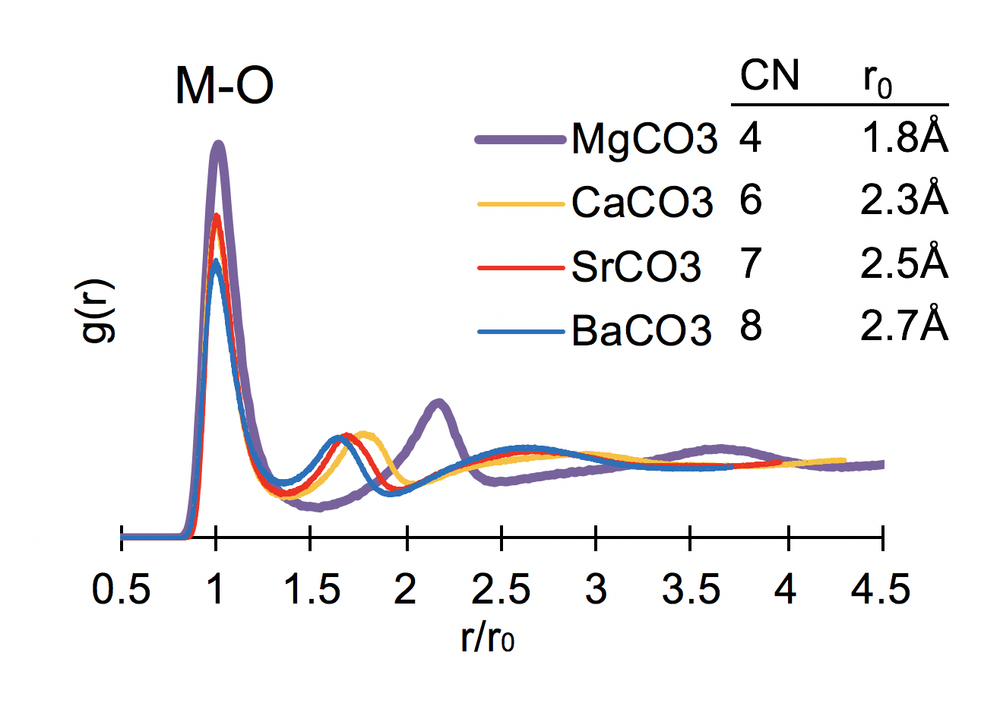
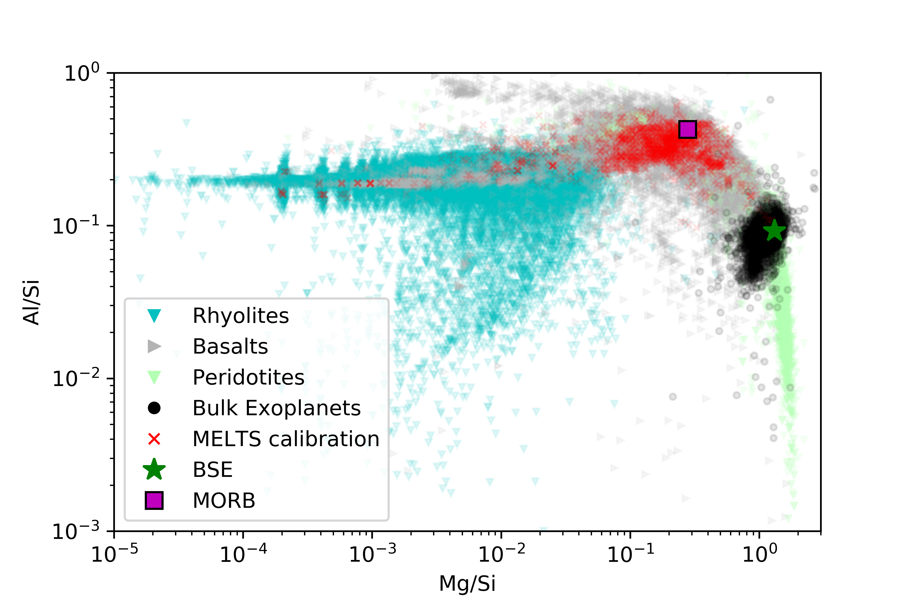

My research interests span a broad range of topics including planetary science, geochemistry, geophysics, and statistical analysis.
In particular, the bulk of my work is focused on understanding the role that silicate melts play in planetary formation and evolution.
<!-- chemistry and thermodynamics of pla. -->
I approach this topic with a variety of techniques, including diamond anvil cell experiments, thermodynamic modeling of first principles calculations, and simplified atomic-scale modeling.
I have also done work on determining the interior properties of extrasolar planets through their orbital evolution, as well as various applications of Bayesian statistical techniques toward understanding various fields in the geosciences.
Below I describe a number of these research projects in more detail, and you can see a list of my publications [here](publications.html).

### Open Projects found at: [gitlab.com/ENKI-portal](http://gitlab.com/ENKI-portal), [github.com/aswolf](http://github.com/aswolf)

In support of the goals of Open Science, to make research more accessible and reproducible (i.e. more scientific), I have begun posting many of my projects on github and gitlab (some projects remain temporarily private, access granted on request).

 

#### I encourage you to take a look and think about what you can do to make your science more open!

## Silicate Liquids at High Pressure and Magma Ocean Evolution

Determining the evolution of the Earth's mantle since formation is a crucial topic to understanding its present state.
This is particularly true given that temperature and composition are often highly degenerate in seismic observations of the mantle.
It has long been thought that the Earth likely went through one or more periods in which the mantle was predominantly or entirely molten.
This magma ocean scenario is a simple consequence of the extremely large energies involved in terrestrial planet accretion.
Recent experimental and theoretical work have shown that the properties of high pressure silicates are rather different from what was previously supposed, implying that crystallization of a magma ocean proceeds from the center outward rather than from the bottom up.
This shift in our understanding is a consequence of the depths of both crystallization and neutral crystal buoyancy.
To better understand the evolutionary path of a crystallizing magma ocean, I have developed a new liquid equations of state for the dominant component in rocky mantles (MgSiO3) (see Wolf et al. 2018).
I have also co-developed a numerical modeling code called SPIDER: “Simulating Planetary Interior Dynamics with Extreme Rheology”, published in Bower et al. 2018 and hosted at https://bitbucket.org/djbower/spider.

 

## Simplified Modeling of Silicate Liquids at Mantle Conditions

The dynamically important properties of high pressure silicate liquids are defined by composition-dependent equilibrium conditions.
It is thus important to develop a simple model of silicate liquids that allows rapid determination of equations of state in a large chemically relevant system.
I have developed the Coordinated Hard Sphere Mixture (CHaSM), which can rapidly predict the behavior of complex silicate liquids over wide ranges in Temperature, Pressure, and Composition (Wolf et al. 2015).
The original publication demonstrated this new technique on a simplified chemistry, and the model is currently being extended to cover a wide range of chemistries relevant to rocky planets.

 

## Structure and Thermodynamics of Carbonate-rich Melts

Carbonate melts play a crucial role in planetary carbon cycles, transporting carbon to the surface and inhibiting continued subduction into the lower mantle.
Melting of carbonate-bearing rocks strongly modifies the mantle solidus, lowering it by $\sim$500 C at 10 GPa \citep{Ghosh2009}, potentially enabling widespread low-degree partial melting.
Despite their importance, the thermodynamics of carbonate-bearing melts are poorly understood largely due to experimental challenges with decarbonation.
This work is supported by a collaborative NSF PI grant, exploring the thermodynamics of alkaline earth carbonate melts, synthesizing liquid simulations, melt detection experiments, and thermodynamic modeling.
Hurt and Wolf (2018) develops a new potential model for {(Ca, Mg, Sr, Ba)CO$_3$} liquids, enabling atomistic simulations at mantle pressures.
Ongoing work reveals strongly divergent thermophysical properties for Mg-bearing carbonate melts, owing to their distinct atomic structure, dramatically affecting the buoyancy of MgCO$_3$-bearing melts (Hurt and Wolf, in prep).

 

## Accurate Geologic Thermodynamic Databases & extending to Extrasolar Planets

Thermodynamic models provide a theoretical framework for extrapolating experimental databases to understand geologic processes, but their calibration and use is often restricted to high-level experts.
Limits on data quantity and quality demand simplified models that remain accurate over narrow regions of pressure-temperature-composition space.
Thermodynamic database modeling is plagued by strong parameter correlations and variable uncertainties that are rarely reported, making it difficult to assess model accuracy.
This work is supported by a collaborative NSF PI grant to develop general Bayesian thermodynamic modeling tools & techniques, and using them to create a new MELTS model calibration.
This includes an extension of the high-pressure pMELTS model to explore core-formation and differentiation in exoplanets affected by exotic non-terrestrial chemistries.
By simplifying calibration, the open source tools I'm developing will open up thermodynamic model building to the wider community, enabling researchers to specially tune models for their own areas of interest.

 

## Bayesian Data Analysis Applications in Geosciences
Many scientific investigations require only a basic knowledge of statistics in order to obtain reasonable results.
Unfortunately, all too often researchers will apply a simple statistical method when the data really requires more sophisticated techniques.
Starting early on in graduate school, I began to collaborate with friends and colleagues to help provide the statistical know-how to carry out their investigations when the observation type, data quality, or system complexity ruled out standard simple approaches.
This has lead me to collaborations in a wide range of areas:

#### Bayes' Theorem

 (from wikipedia) 

* measuring lake depths on Titan
* inferring the chemical composition of extrasolar planetary atmospheres
* disentangling the effects of temperature, drought, and fire on the carbon cycle
* constraining the resurfacing history of Venus based on its crater record

These publications are some of the most fun because they represent tricky statistical problems that are spread widely across science.
(*For more information on these projects, see my [publications](publications.html)*)

## High P-T Diamond Anvil Cell Experiments

 (image from Steve Jacobsen) 

Iron-bearing magnesium silicate perovskite (recently named Bridgmanite) is thought to be the dominant mineral in the Earth's lower mantle, occupying ~80% by volume.
This makes it one of the most crucial phases to understanding the structure and long-term evolution of the Earth.
Wolf et al. (2015), characterizes the composition-dependent compression behavior of perovskite at realistic mantle conditions using laser-heated diamond anvil cell experiments.
Synchrotron X-ray diffraction experiments were carried out at the Advanced Photon Source, measuring the high temperature compression curves for (Mg,Fe)SiO3 perovskite in a quasi-hydrostatic neon pressure medium for a range of iron compositions.
The resulting powder diffraction profiles are then fit to obtain perovskite volumes as a function of pressure and temperature.
From the extracted volumes, I construct high temperature equations of state for both Fe-bearing and Fe-free compositions, comparing with careful reanalysis of literature data.
Using Bayesian statistical techniques that are robust to outliers in the dataset, we are able to show that the thermal expansion trends with temperature for perovskite (even in the absence of iron) are considerably higher than previously thought.

## Developing Open Source Scientific Tools

 (from wikipedia) 

The work that we can do is largely shaped by the tools we have available.
We can always spend time building new tools when none exist, and in science, we do this quite frequently.
But spending time reinventing the wheel is rarely wise and the range of ideas we have for new studies are often strongly tethered to our notions of what is already possible.
It is thus to our collective benefit to share as much as possible the tools and datasets that we have worked to develop, better enabling everyone to reap the rewards of our past efforts.
To this end, I am involved in a number of projects to make publicly available the various software tools I develop in the course of my work.
Most of these tools (written in Python and MATLAB) are focused on analyzing experimental and theoretical mineral physics data, as well as performing theoretical mineral physics simulations.
As noted at the top of this page, I am making these tools freely available for public use or re-purposing, distributing them from my repositories on github [github.com/aswolf](http://github.com/aswolf).
(*Part of this work helps to support an EAR/Geoinformatics grant with Przemek Dera and colleagues)*

