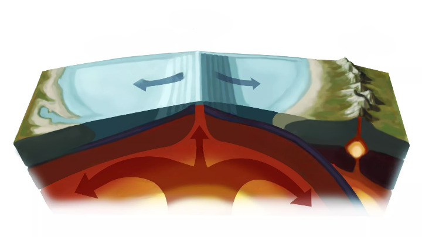
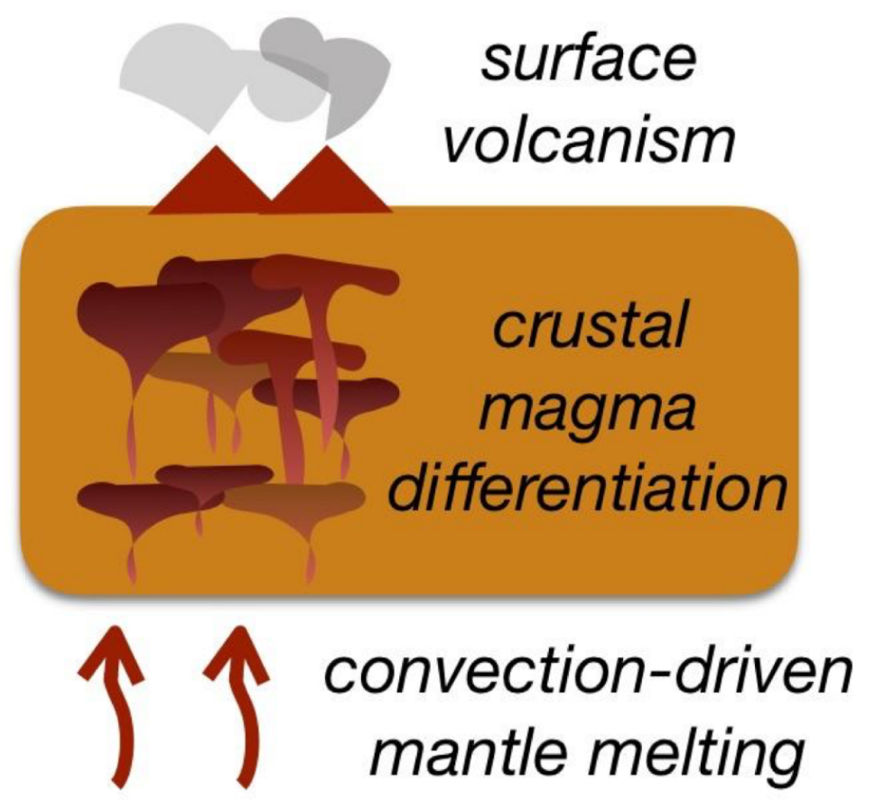
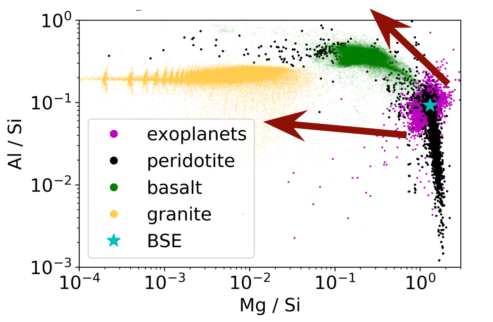
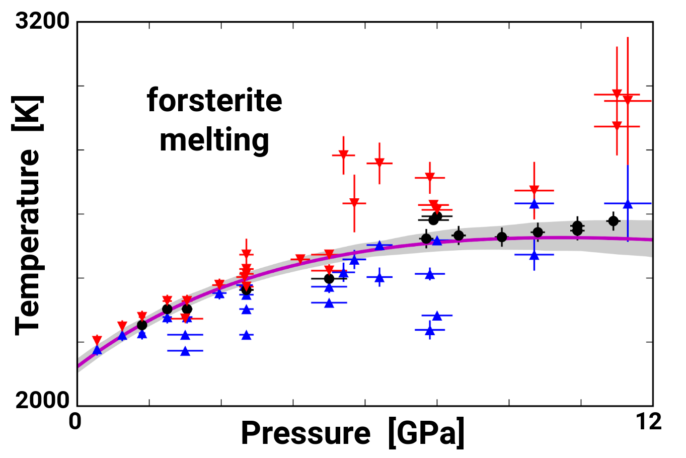

## Understanding Melt-driven Evolution of Rocky Planets...

My research interests span a broad range of topics including planetary science, geochemistry, mineral physics, and statistical analysis.
In particular, **the bulk of my work is focused on understanding how silicate melts drive rocky planet formation and evolution**.
This includes their role in both the formation of planetary interiors---through core-formation and magma ocean evolution---as well as the compositional evolution of planetary surfaces---through volcanism and outgassing.
I approach this topic using a variety of computational techniques, including thermodynamic model building, thermo- and geo-dynamic simulation, atomistic simulation, and statistical analysis.
All of this work has been generously supported by a combination of PI and co-PI grants from the NSF, NASA, and Sloan.
I have also done work on determining the interior properties of extrasolar planets through their orbital evolution, as well as various applications of Bayesian statistical techniques toward understanding various fields within Earth and planetary sciences.
Below I describe a number of these research projects in more detail, and you can see a list of my publications [here](publications.html).

### Open Projects found at: [gitlab.com/ENKI-portal](http://gitlab.com/ENKI-portal), [github.com/aswolf](http://github.com/aswolf)

In support of the goals of Open Science, to make research more accessible and reproducible (i.e. more scientific), I have transitioned to posting most of my projects on github and gitlab (some projects remain temporarily private, access granted on request). This work is supported by both NSF and NASA grants and plays a major role in the ENKI project, which aims to develop and provide tools for unified thermodynamic and geodynamic computation.

 

#### I encourage you to take a look and think about what you can do to make your science more open!

## Magma Oceans & Core Formation

<!-- Determining the evolution of the Earth's mantle since formation is a crucial topic to understanding its present state.
This is particularly true given that temperature and composition are often highly degenerate in seismic observations of the mantle. -->
Due to the extreme energies involved in terrestrial planet formation, the Earth, moon, and other rocky planets likely experienced one or more magma ocean phases in which their mantles were predominantly or entirely molten.
At the same time, growing rocky planets undergo metal-rock segregation and core formation, producing a metallic iron core that is alloyed with a large and uncertain complement of light elements.
<!-- This magma ocean scenario is a simple consequence of the extremely large energies involved in terrestrial planet accretion. -->
The evolutionary path taken by each planet is highly sensitive to both planetary size and chemistry, as the crystals formed during magma ocean cooling and the solubility of light elements in the core are strongly dependent on pressure, temperature, and composition.
Modeling the evolution of these magma oceans relies upon a mixture of thermodynamics (governing crystallization and chemical evolution) and geodynamics (controlling chemical and heat transport).
<!-- Recent experimental and theoretical work have shown that the properties of high pressure silicate melts are rather different from what was previously supposed, implying that crystallization of deep magma ocean proceeds from the center outward rather than from the bottom up.
This shift in our understanding is a consequence of the depths of both crystallization and neutral crystal buoyancy. -->
To better understand crystallization of deep planetary-scale magma oceans, I have developed a new liquid equation of state for the dominant component in rocky mantles (MgSiO3) (see Wolf et al. 2018).
I have also co-developed a numerical geodynamic modeling code called SPIDER: “Simulating Planetary Interior Dynamics with Extreme Rheology”, published in Bower et al. 2018 and hosted at https://bitbucket.org/djbower/spider.
Current work focuses on extending simulations to realistic chemical compositions, imposing thermochemical equilibrium while allowing for buoyancy-driven crystal transport across the full range of magma ocean depths (from the small lunar magma ocean up through deep magma oceans on  super-Earth-sized exoplanets).

 

## Mantle Melting & Crustal Evolution

 (from livescience.com) 

The formation of rocky planetary surfaces rests upon the thermochemical details of silicate melting and crystallization.
Primitive basaltic crusts are derived from the partial melting of upper mantle material, which then rises to the surface where it crystallizes.
Trace element partitioning studies are able to uncover the details of this primordial mantle melting process, and I have created an accurate thermodynamic/statistical model of partitioning under the full range of planetary melting conditions as part of a collaborative NSF-funded project (Cung et al. currently under review).
Further differentiation into the wide variety of rock types seen on Earth involves remelting and fractional crystallization of the basalt (induced by subducting slabs), generating evolved rock compositions extending all the way to $SiO_2$-rich granites.
Progressive evolution of surface rock compositions is highly sensitive to even modest changes in initial planetary mantle composition, enabling shifts in the chemical trajectory that could produce volcanic rocks that are highly distinct from those on Earth.
As a part of the ENKI project, I am developing thermodynamic tools that enable easy simulation of mantle and crustal melting (MagmaForge) as well as simulation of trace element partitioning critical to determining the formation histories of mantle-derived igneous rocks (MagmaTrace).

 

## Volcanic Outgassing & Primitive Atmospheres

Silicate melts play a major role in determining primitive planetary atmospheres through volcanic outgassing.
Outgassing occurs at the surface of molten silicates where atoms can escape from the liquid state into the overlying gas.
The molecular abundances of these gas species are determined by the chemical potentials (or composition-dependent energetics) of the silicate liquid.
Through surface outgassing of a magma ocean and/or long-lived planetary volcanism, these gases form the basis of a planet's primordial atmosphere.
From that point, the atmospheric composition can be modified by photochemistry, atmospheric escape, or the presence of life.
Unlike planetary interiors or crusts, atmospheric compositions can even be measured for distant exoplanets using transit spectroscopy, thus providing an invaluable tool for observing compositions of extrasolar planets.
I have developed a volcanic outgassing model (VapoRock) to predict outgassed atmospheric abundances as a tool for simulating planetary evolution and for interpreting composition measurements of exoplanetary atmospheres like those expected from the Kepler space telescope.
Our recently accepted paper (publication in the Astrophysical Journal later this year) shows how VapoRock displays dramatic increases in accuracy (by orders of magnitude) over other available modeling tools due to the underlying thermodynamics used to describe the silicate liquid.
This work is supported by a NASA grant studying the early formation and late-stage vaporization of rocky exoplanets.

 

## Silicate Melting at Extreme Pressures & Exotic Compositions

<!--  -->

<!-- The dynamically important properties of high pressure silicate liquids are defined by composition-dependent equilibrium conditions.
It is thus important to develop a simple model of silicate liquids that allows rapid determination of equations of state in a large chemically relevant system. -->
While the properties of silicate melts play many key roles in the evolution of rocky planets, our understanding of these melts are rooted in experimental (and theoretical) techniques that are generally biased toward lower pressures and typical Earth-like compositions.
To model many important planetary processes, however---like deep magma ocean crystallization and volcanism on rocky exoplanets with exotic compositions---we need to extend our current models to pressure/composition regimes that are not currently accessible.
To this end, I developed the Coordinated Hard Sphere Mixture (CHaSM) model, which can rapidly predict melt-behavior over wide pressure ranges by accounting for compression-induced structural evolution in silicate liquids (Wolf et al. 2015).
<!-- The original publication demonstrated this new technique on a simplified chemistry, and the model is currently being extended to cover a wide range of chemistries relevant to rocky planets. -->
Ongoing work is supported by a collaborative NSF PI grant to develop general Bayesian thermodynamic modeling tools & techniques, and using them to create a new MELTS model calibration.
Additionally, I have begun extending the original MELTS model to span the full oxide compositional range (creating the new exoMELTS model), including low-silica and high alumina compositions important for both exoplanets and early solar system grains (NASA ICAR grant currently under review).
<!-- This includes an extension of the high-pressure pMELTS model to explore core-formation and differentiation in exoplanets affected by exotic non-terrestrial chemistries. -->

 

## Structure and Thermodynamics of Carbonate-rich Melts

Carbonate melts play a crucial role in planetary carbon cycles, transporting carbon to the surface and inhibiting continued subduction into the lower mantle.
Melting of carbonate-bearing rocks strongly modifies the mantle solidus, lowering it by $\sim$500 C at 10 GPa (Ghosh et al. 2009), potentially enabling widespread low-degree partial melting.
Despite their importance, the thermodynamics of carbonate-bearing melts are poorly understood largely due to experimental challenges with decarbonation.
This work is supported by a collaborative NSF PI grant, exploring the thermodynamics of alkaline earth carbonate melts, synthesizing liquid simulations, melt detection experiments, and thermodynamic modeling.
Hurt and Wolf (2018) develops a new potential model for (Ca, Mg, Sr, Ba)CO$_3$ liquids, enabling atomistic simulations at mantle pressures.
Hurt & Wolf (2020) revealed strongly divergent thermophysical properties for Mg-bearing carbonate melts, owing to their distinct atomic structure, dramatically affecting the buoyancy of MgCO$_3$-bearing melts.

 

## Bayesian Data Analysis Applications in the Planetary Sciences

While many scientific investigations obtain reasonable results with standardized statistical methods, complex natural processes and limited or biased datasets can destroy the usability and accuracy of pre-canned statistical routines.
<!-- Unfortunately, all too often researchers will apply a simple statistical method when the data really requires more sophisticated techniques. -->
Starting early on in graduate school, I began to collaborate with friends and colleagues to help provide the statistical know-how to carry out investigations when the observation type, data quality, or system complexity ruled out standard simple approaches.
This has led to an NSF-supported project on rebuilding the MELTS silicate liquid model to incorporate Bayesian statistical methods, enabling integrated prediction-confidence bounds for every melting simulation.
Additionally, I have participated as a statistical expert in many collaborations across a wide range of areas:

<!-- 

#### Bayes' Theorem

 (from wikipedia) 

 -->
* measuring lake depths on Titan
* inferring the chemical composition of extrasolar planetary atmospheres
* disentangling the effects of temperature, drought, and fire on the carbon cycle
* constraining the resurfacing history of Venus based on its crater record

These publications are some of the most fun because they represent tricky statistical problems that are spread widely across the many sub-disciplines of planetary science.
(*For more information on these projects, see my [publications](publications.html)*)

 

<!-- ## Accurate Geologic Thermodynamic Databases & extending to Extrasolar Planets

Thermodynamic models provide a theoretical framework for extrapolating experimental databases to understand geologic processes, but their calibration and use is often restricted to high-level experts.
Limits on data quantity and quality demand simplified models that remain accurate over narrow regions of pressure-temperature-composition space.
Thermodynamic database modeling is plagued by strong parameter correlations and variable uncertainties that are rarely reported, making it difficult to assess model accuracy.
This work is supported by a collaborative NSF PI grant to develop general Bayesian thermodynamic modeling tools & techniques, and using them to create a new MELTS model calibration.
This includes an extension of the high-pressure pMELTS model to explore core-formation and differentiation in exoplanets affected by exotic non-terrestrial chemistries.
By simplifying calibration, the open source tools I'm developing will open up thermodynamic model building to the wider community, enabling researchers to specially tune models for their own areas of interest.

 
 -->

<!-- ## Developing Open Source Scientific Tools

 (from wikipedia) 

The work that we can do is largely shaped by the tools we have available.
We can always spend time building new tools when none exist, and in science, we do this quite frequently.
But spending time reinventing the wheel is rarely wise and the range of ideas we have for new studies are often strongly tethered to our notions of what is already possible.
It is thus to our collective benefit to share as much as possible the tools and datasets that we have worked to develop, better enabling everyone to reap the rewards of our past efforts.
To this end, I am involved in a number of projects to make publicly available the various software tools I develop in the course of my work.
Most of these tools (written in Python and MATLAB) are focused on analyzing experimental and theoretical mineral physics data, as well as performing theoretical mineral physics simulations.
As noted at the top of this page, I am making these tools freely available for public use or re-purposing, distributing them from my repositories on github [github.com/aswolf](http://github.com/aswolf).
(*Part of this work helps to support an EAR/Geoinformatics grant with Przemek Dera and colleagues)*

 -->
